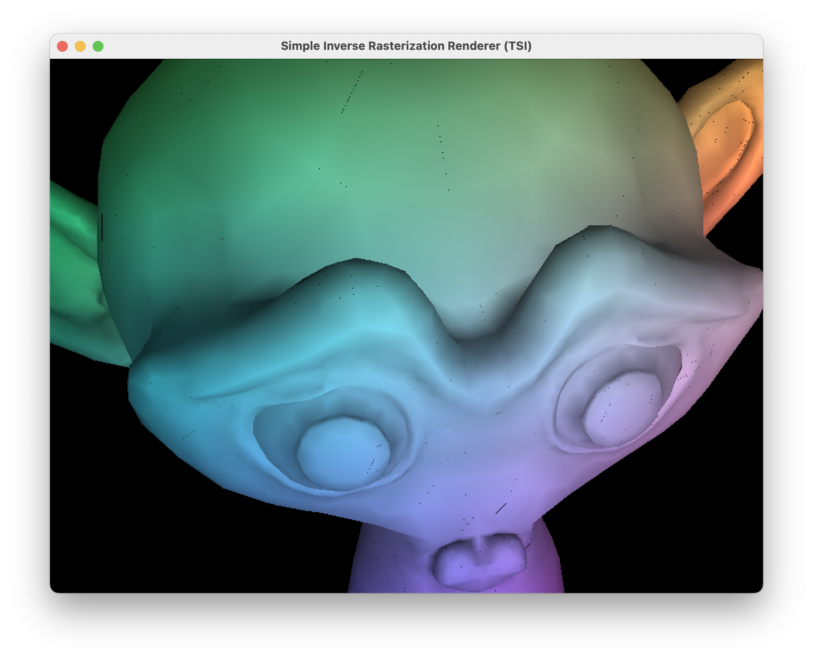

# A "Do it yourself" renderer

This is a simple rendering engine made in Java.



## Build

Use the following command to build the project:

```bash
make
```

it compiles all the sources and places them in the `build` folder.

```bash
make clean
```

cleans the `build` folder.

To run the tests use the following command:

```bash
make tests
```

## Run

To run the project you can use the following command:

```bash
make run SCENE=path/to/file.scene
```

where `path/to/file.scene` is the path to the scene file, e.g. `data/example0.scene`.
